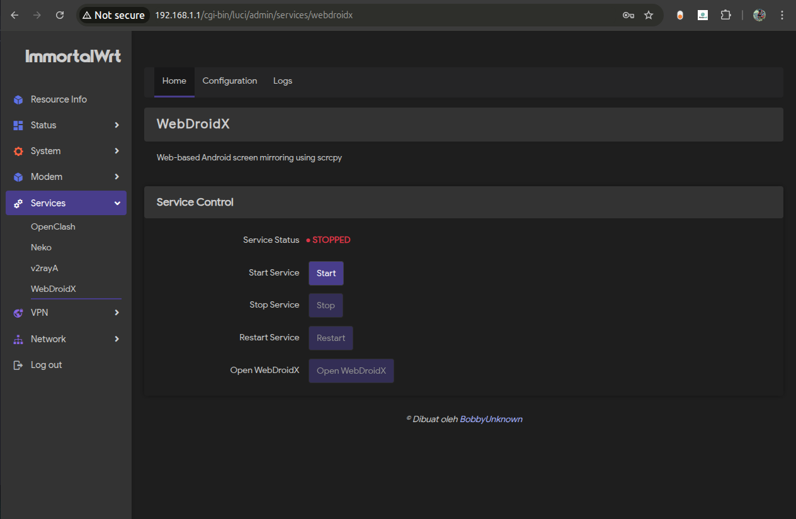
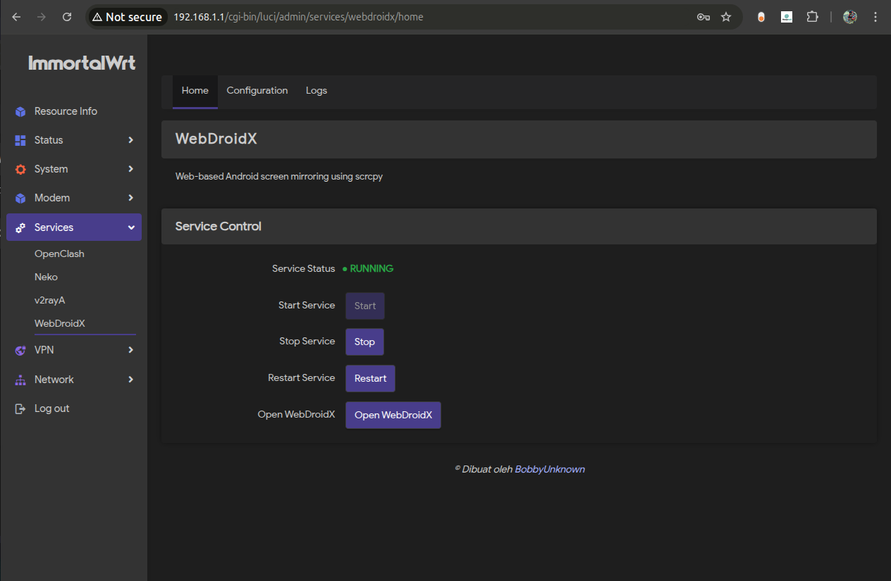
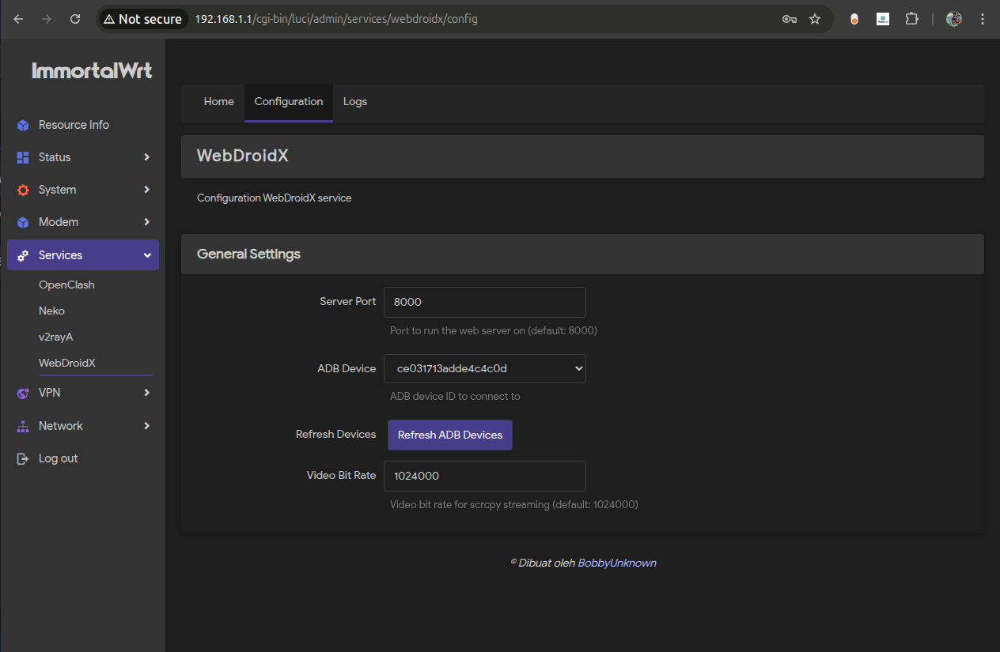
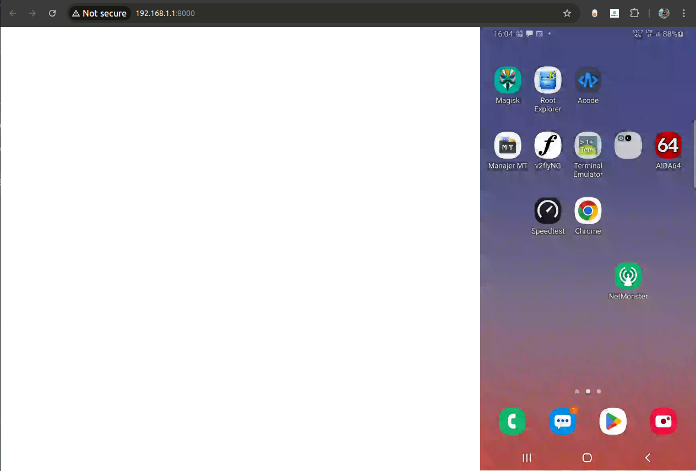

# WebDroidX - Android Screen Mirroring for OpenWrt

[](https://t.me/+TuLCASzJrVJmNzM1)
[](https://github.com/bobbyunknown/WebDroidX)
[](https://github.com/bobbyunknown/WebDroidX/releases)

> **Language / Bahasa:** **🇺🇸 English** | [🇮🇩 Bahasa Indonesia](README.md)

WebDroidX is a web-based screen mirroring solution that allows you to control and view your Android device via a web browser. This project is specifically developed for OpenWrt/ImmortalWrt with multi-architecture support.

## 🚀 Key Features

- **Screen Mirroring**: Display Android screen in real-time on the browser
- **Remote Control**: Control Android device via web interface
- **Multi-Architecture**: Supports x86_64 and aarch64
- **Web-based**: No need to install additional apps on the client
- **OpenWrt Integration**: Fully integrated with LuCI interface

## 📸 Screenshots

<details>
<summary>Home Interface</summary>



</details>

<details>
<summary>Configuration Page</summary>


</details>

<details>
<summary>Android Device Control</summary>


</details>

## 📦 Project Structure

```
WebDroidX/
└── luci-app-webdroidx/     # LuCI web interface
    ├── htdocs/            # Static web files
    ├── etc/               # Configuration files
    └── usr/               # System files
```

## 🛠️ Components

### LuCI App
- **Web Interface**: Web-based interface for configuration
- **Init Script**: Service management for OpenWrt
- **Configuration**: System configuration files

## 📋 System Requirements

- **OpenWrt/ImmortalWrt** with LuCI
- **Architecture**: x86_64 or aarch64
- **Dependencies**:
  - adb (Android Debug Bridge)
  - screen (terminal multiplexer)
- **Storage**: ~15MB free space

## 🔧 Installation

### 1. Install Core

```bash
bash -c "$(curl -fsSL https://raw.githubusercontent.com/bobbyunknown/WebDroidX/refs/heads/main/install.sh)"
```

### 2. Install Package

```bash
# Download luci app on release
# Install luci-app
opkg install luci-app-webdroidx_*.ipk
```

## ⚙️ Configuration

### 1. Access Web Interface
- Open browser and access: `http://[router-ip]/cgi-bin/luci/admin/services/webdroidx`
- Login with your OpenWrt credentials

### 2. Configure Android Device
- Enable **Developer Options** on Android
- Enable **USB Debugging**
- Connect device via USB or WiFi ADB

### 3. Start Service
```bash
# Start webdroidx service
/etc/init.d/webdroidx start

# Enable auto-start
/etc/init.d/webdroidx enable
```


## 🎯 Usage

1. **Connect Device**: Ensure Android device is connected via ADB
2. **Start Service**: Run webdroidx service via LuCI or command line
3. **Access Interface**: Open web interface to start screen mirroring
4. **Control Device**: Use mouse and keyboard to control Android

## 🔍 Troubleshooting

### Device Not Detected
```bash
# Check ADB connection
adb devices

# Restart ADB server
adb kill-server
adb start-server
```


### Service Not Running
```bash
# Check service status
/etc/init.d/webdroidx status

# Check logs
logread | grep webdroidx
```

### Port Conflict
- Default port: 8080
- Change port in configuration if conflict arises

## 🏗️ Development

### Build Requirements
- OpenWrt SDK
- Make tools

### Architecture Support
This project supports:
- **x86_64**: Intel/AMD 64-bit
- **aarch64**: ARM 64-bit (Raspberry Pi 4, etc)
## 📄 License

This project is licensed under the MIT License. See LICENSE file for details.

## 👨‍💻 Contributors

- **BobbyUnknown** - Lead developer
- **Community** - Bug reports and feature requests

## 📞 Support

If you encounter any issues or have questions:
1. Check troubleshooting documentation above
2. Create an issue in the GitHub repository
3. Join the OpenWrt community for discussion

---

**WebDroidX** - Bringing Android screen mirroring to your OpenWrt router! 🚀